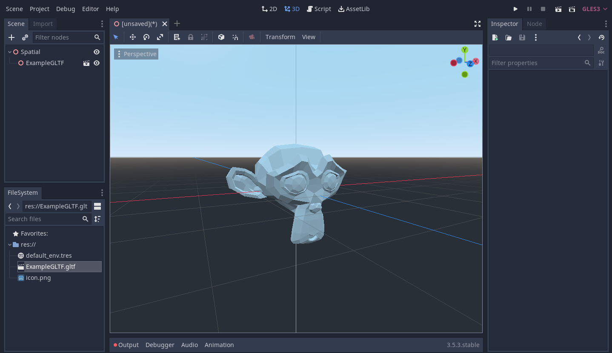

# 3D Worlds and The Web
I've had the privalege of learning a lot about how the web works from an Instructor who, for a period of time, also developed the front and backend for many of my college's actual web apps and infrastructure. *In fact*, if you want a good reference on how to make client-side web applications: [here's the textbook we're using](https://info340.github.io/). It's Creative Commons licensed.
## The Shape of Web Content
The web as we know it today is governed by a near universal design principle that will be familiar to anyone who writes code regularly; [Separation of Concerns](https://en.wikipedia.org/wiki/Separation_of_concerns). To put it simply, when following the design principle of Separation of Concerns; you should separate different parts of your program that handle different fundamentally different tasks in your program. 

This design principle simplifies project design and encourages modularity. For the web this design principle has been widely accepted and adopted into our modern web browsing experience.

Currently; the whole of a 2D web page is broken into 3 distinct domains of concerns; **Content,** **Style,** and **Interactivity**. Much of the modern web uses [HTML](https://developer.mozilla.org/en-US/docs/Web/HTML) for the Content, [CSS](https://www.w3schools.com/Css/) to define formatting, and [Javascript](https://developer.mozilla.org/en-US/docs/Web/javascript) to define special interactivity and functions beyond body and style.

Actually, if you only care about content; you don't even need write any CSS or Javascript. From a technical standpoint, they are 100% optional. (Aesthetically however, you'll at least want *some* style.) I won't go into detail about how to use them, take a look at the [textbook I mentioned earlier](https://info340.github.io/) if you are really interested.

Now, this is really interesting, because it means that when you browse to a web page you're actually only asking for the *content* of the page. Once that content arrives; it itself then contains references to stylesheets and dynamic code that it needs, that your web browser then goes and requests separately. 

This *sounds* inefficient on the surface; but its quite the opposite. This structure means that the content, *the thing that actually matters* is always delivered first. On top of that, since the web browser is the one making the decision to load content; you could selectively *just not* load optional content that you don't want or your device/connection can't handle. Not to mention the improved resource efficiency! Many website use the same style across multiple pages; but this design pattern means that each page on the site can just to *the exact same stylesheet file.* And don't even get me started on the potential network efficiencies of *caching* commonly used files.

Cool! This seems to flow in stark contrast to how VRChat seems to work. (Full disclosure, this is an educated guess as VRChat is a proprietary, closed-source project. The best I can do that doesn't break TOS.) When you create content for VRChat, the uploader compiles your assets into a package file then sends that off to their Content Delivery Network (CDN). In-game, when someone loads your content; be it an avatar or world, the game appears to download the **entire** file before loading.

VRChat's CDN operates at starkly different scales than a common web browser. *And yes it would be uncanny to have people's avatars load in piecemeal.* But for worlds especially, it feels strange to do it this way. We've already hit a bit of a problematic trend with *larger* and **larger** and ***larger*** world sizes to the point where a not insignificant number of users *struggle* to run them.

Now, obviously there would be some new challenges to tackle, but as a designer; I can't stop myself but wonder if VR worlds could be improved by adopting an internal structural pattern similar to web pages?
## The Next Step
### What's out there?
Okay, so where do we go from here? Can we travel the web in VR? Well, not yet. After some googling, there appear to be some smaller attempts at achieving similar results with various caveats that make most of them not an option for us.

- [CSS has a way to do 3D transforms of webpage objects.](https://www.w3schools.com/Css/css3_3dtransforms.asp) But that's scooting document components around, a far cry from rendering 3D geometry. 
- There's a new [X3D Standard approved by the ISO that appears to do what we need]. But sitting down to read it; it feels like corporate BS. There's pages and pages of deep technical information, 95% of which are all just reimplementations and redefinitions of things that many game engines *already do and efficiently*. Why on earth would you reinvent and redefine the entire stack when, in modern day practice; the representation of a web resource is the responsibility of the software rendering the resource??? We don't need a paradigm we need a communication standard.
	- (Sidebar, what the actual hell ISO. Why are you charging over $200 to read a web page. If you're interested, read it [here from the organization that actually wrote the standard](https://www.web3d.org/specifications/X3Dv4/ISO-IEC19775-1v4-IS/) .)
- Mozilla has done some work on [WebXR](https://developer.mozilla.org/en-US/docs/Web/API/WebXR_Device_API/Fundamentals), [but it's just a passthrough API for web-based VR](https://developer.mozilla.org/en-US/docs/Web/API/WebXR_Device_API/Fundamentals#what_webxr_is_and_isnt). It doesn't render *anything* only serves as an access point for web applications to get VR tracking data and push frames to the headset. We'll likely use it, but we'll need more.
- Mozilla Has also created [Hubs by Mozilla](https://hubs.mozilla.com/) which *again* looks like what we're trying to build but it's behind a paywall and appears to use paid services to host it. (Supprising the organization behind Firefox thought a closed source Minecraft: Realms style personal metaverse was a good idea.)

But okay, this is just poking around on the *web* side of things, what does the game engine side of the problem look like? Well, we're kinda in luck!
### GLTF
Khronos Group has developed the [GLTF](https://en.wikipedia.org/wiki/GlTF) file format which stores a 3D asset in JSON, usually coupled with asset binaries either packed in a seprate `.glb` file or sometimes stored directly in the JSON. This is a good candidate since the rest of the web *already speaks JSON fluently*. And yeah! 

Godot Natively supports GLTF, which is great! But there's something silly afoot. GLTF is a structured format that uses an inherently *unstructured* language, JSON, to transmit it's data. JSON is meant to be unstructured and flexible because it is a data exchange and storage format where both the writing and reading ends of the communication *already know* what they are talking about.

This makes it a poor candidate to base your formats on *because it has no inherent way to validate itself.* You must write your own data validation software to sanity check that your files are valid or (horrifyingly) do some logistical gymnastics to try and parse the JSON into something that makes sense. It works but it's definitely not ideal, and there's good reason it's relegated to purely data transfer; that's just what it's meant for.

### Godot Scene
https://docs.godotengine.org/en/4.2/contributing/development/file_formats/tscn.html

### Where are we going?