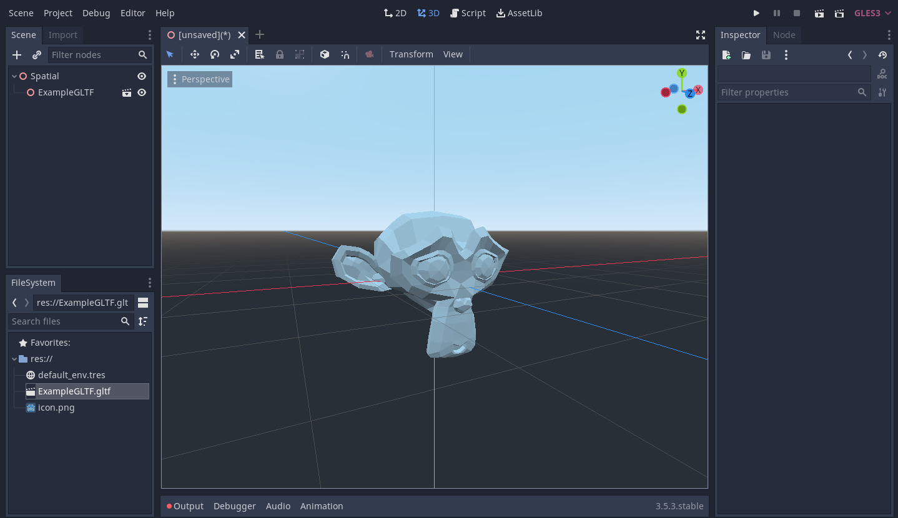
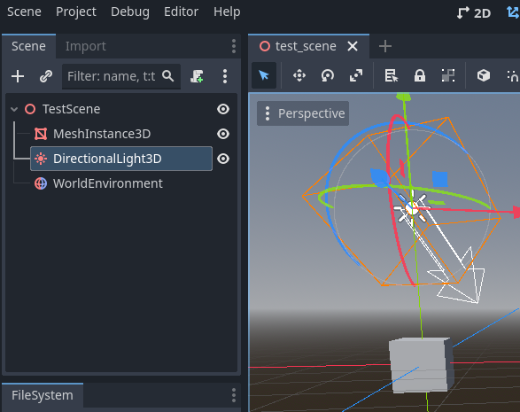

## What's out there?
Okay, so where do we go from here? Can we travel the web in VR? Well, not yet. After some googling, there appear to be some smaller attempts at achieving similar results with various caveats that make most of them not an option for us.

- [CSS has a way to do 3D transforms of webpage objects.](https://www.w3schools.com/Css/css3_3dtransforms.asp) But that's scooting document components around, a far cry from rendering 3D geometry. 
- There's a new [X3D Standard approved by the ISO that appears to do what we need]. But sitting down to read it; it feels like corporate BS. There's pages and pages of deep technical information, 95% of which are all just reimplementations and redefinitions of things that many game engines *already do and efficiently*. Why on earth would you reinvent and redefine the entire stack when, in modern day practice; the representation of a web resource is the responsibility of the software rendering the resource??? We don't need a paradigm we need a communication standard.
	- (Sidebar, what the actual hell ISO. Why are you charging over $200 to read a web page. If you're interested, read it [here from the organization that actually wrote the standard](https://www.web3d.org/specifications/X3Dv4/ISO-IEC19775-1v4-IS/) .)
- Mozilla has done some work on [WebXR](https://developer.mozilla.org/en-US/docs/Web/API/WebXR_Device_API/Fundamentals), [but it's just a passthrough API for web-based VR](https://developer.mozilla.org/en-US/docs/Web/API/WebXR_Device_API/Fundamentals#what_webxr_is_and_isnt). It doesn't render *anything* only serves as an access point for web applications to get VR tracking data and push frames to the headset. We'll likely use it, but we'll need more.
- Mozilla Has also created [Hubs by Mozilla](https://hubs.mozilla.com/) which *again* looks like what we're trying to build but it's behind a paywall and appears to use paid services to host it. (Surprising the organization behind Firefox thought a closed source Minecraft: Realms style personal metaverse was a good idea.)

But okay, this is just poking around on the *web* side of things, what does the game engine side of the problem look like? Well, we're kinda in luck!
## GLTF
Khronos Group has developed the [GLTF](https://en.wikipedia.org/wiki/GlTF) file format which stores a 3D asset in JSON, usually coupled with asset binaries either packed in a separate `.glb` file or sometimes stored directly in the JSON. This is a good candidate since the rest of the web *already speaks JSON fluently*. And yeah! 



Godot Natively supports GLTF, which is great! But there's something silly afoot. GLTF is a structured format that uses an inherently *unstructured* language, JSON, to transmit it's data. JSON is meant to be unstructured and flexible because it is a data exchange and storage format where both the writing and reading ends of the communication *already know* what they are talking about.

This makes it a poor candidate to base your formats on *because it has no inherent way to validate itself.* You must write your own data validation software to sanity check that your files are valid or (horrifyingly) do some logistical gymnastics to try and parse the JSON into something that makes sense. Sure, it can work but it's definitely not ideal, and there's good reason it's relegated to purely data transfer; that's just what it's meant for. Khronos knows this, in fact; they have to provide their own GLTF validator tools because the sublanguage they are using is too flexible.
## Godot Scene
[Godot's Scene format](https://docs.godotengine.org/en/4.2/contributing/development/file_formats/tscn.html) is a really interesting one, because, on the surface. *It looks like it could work?* If you make a simple Godot (4) scene file like shown:



Your scene file will look something like this:
```tscn
[gd_scene load_steps=5 format=3 uid="uid://c8bj6u4sjt2cj"]

[ext_resource type="BoxMesh" uid="uid://dopuh80btw7e" path="res://new_box_mesh.tres" id="1_6lrum"]

[sub_resource type="ProceduralSkyMaterial" id="ProceduralSkyMaterial_hdj13"]

[sub_resource type="Sky" id="Sky_yubx6"]
sky_material = SubResource("ProceduralSkyMaterial_hdj13")

[sub_resource type="Environment" id="Environment_x3tgb"]
background_mode = 2
sky = SubResource("Sky_yubx6")

[node name="TestScene" type="Node3D"]

[node name="MeshInstance3D" type="MeshInstance3D" parent="."]
mesh = ExtResource("1_6lrum")

[node name="DirectionalLight3D" type="DirectionalLight3D" parent="."]
transform = Transform3D(0.828657, 0.395808, -0.395808, 0, 0.707107, 0.707107, 0.559757, -0.585949, 0.585949, 0, 3, 0)

[node name="WorldEnvironment" type="WorldEnvironment" parent="."]
environment = SubResource("Environment_x3tgb")
```
Surprisingly, It's formatted to be human readable, so that's immediately a plus. It has a well defined and standardized [file structure](https://docs.godotengine.org/en/4.2/contributing/development/file_formats/tscn.html#file-structure)! You'll also notice there's *clear* pattern of what does what and what portion of the file goes where.

The first line, is a document header that defines some metadata about about the scene file. 

There's immediately a section that defines various resources that compose the finished scene. For example; the `ext_resource` line is an external resource link that's pulling a box mesh resource I've intentionally saved to a separate file. The `sub_resource` represents a resource simple or default enough to be built into the file itself.

Next, there's the `node` definitions, these are game object nodes within the engine itself. Godot operates on a purely node-based structure, everything is a tree of nodes on nodes that each perform specialized tasks. All of these nodes define their name, type, and (excluding the root) their parent. Notably they also define the ID of the resource they need.

This is, interesting, TSCN defines internal and external resources but then pulls them in later; unlike HTML which only defines resources at the moment where they are used. Of course **this wasn't built for web**, and as of writing [Godot doesn't support loading external assets at runtime](https://github.com/godotengine/godot-proposals/issues/1632) so that's a problem we'll have to cross at some point.

Though, I'm going to be honest; I'm tentative to use Godot's preexisting formats because I don't want to step on anyone's toes. If my project takes off, I don't want it to put artificial pressure on the Godot development team, *especially* when the format wasn't designed with web loading in mind.
## XML??? HTML???


## todo
Recall from the section on [GLTF](#GLTF), that since it's based on JSON, that it can't validate itself. In 

may need to make a plugin to add custom formatting to vscode.

look into what v-sekai is doing.

